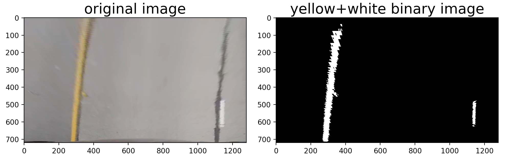
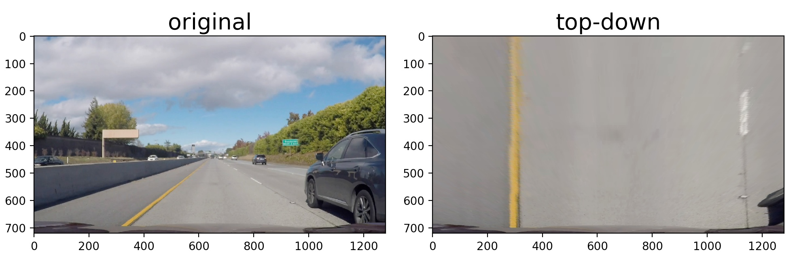
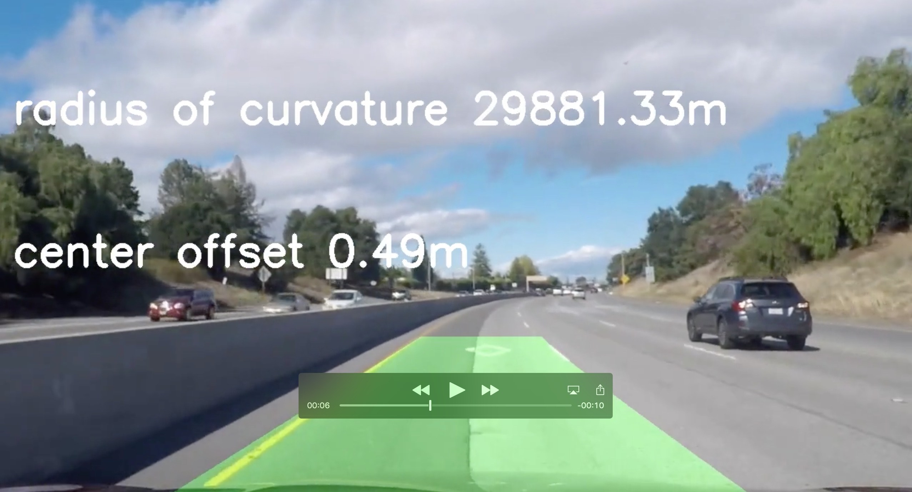

Project 4 - advanced lane finding
---


The goals / steps of this project are the following:

* Compute the camera calibration matrix and distortion coefficients given a set of chessboard images.
* Apply a distortion correction to raw images.
* Use color transforms, gradients, etc., to create a thresholded binary image.
* Apply a perspective transform to rectify binary image ("birds-eye view").
* Detect lane pixels and fit to find the lane boundary.
* Determine the curvature of the lane and vehicle position with respect to center.
* Warp the detected lane boundaries back onto the original image.
* Output visual display of the lane boundaries and numerical estimation of lane curvature and vehicle position.


<br>
<br>

## [Rubric](https://review.udacity.com/#!/rubrics/571/view) Points


###Camera Calibration


The code for this step is contained in the file `cam_correct.py` 

I start by preparing "object points", which will be the (x, y, z) coordinates of the chessboard corners in the world. Here I am assuming the chessboard is fixed on the (x, y) plane at z=0, such that the object points are the same for each calibration image.  Thus, `objp` is just a replicated array of coordinates, and `objpoints` will be appended with a copy of it every time I successfully detect all chessboard corners in a test image.  `imgpoints` will be appended with the (x, y) pixel position of each of the corners in the image plane with each successful chessboard detection.  

I then used the output `objpoints` and `imgpoints` to compute the camera calibration and distortion coefficients using the `cv2.calibrateCamera()` function.  I applied this distortion correction to the test image using the `cv2.undistort()` function and obtained this result: 


###Pipeline

I actually never used the example images to develop my pipeline. I went straight for using frames from the `challenge_video.mp4`. So in this section, I will show example frames from the video for each section below.


#### 1. Distortion-corrected image

I created a helper function `pipeline.load_frame_at_time()` in my `pipeline.py` module at line 37 that takes a time in seconds and grabs a frame from a video at that point. Here is an example of a corrected frame from the challenge video. I chose this frame because it shows very clearly the almost fish-eye distortion of the original picture with the bridge overhead.


<br>


#### 2. Lane pixel finding
I went for regular color thresholding to find my lane pixels. But I searched for yellow and white pixels separately. The code is located in the module `lane_pixels.py` 

In my testing, I could find the yellow pixels easier if I looked in the HSV color space. Centering around a hue value of 20-50 degrees (in the normal 360 degree units) and AND-ing that with a saturation of at least 30%. This ensured I was finding pure yellow pixels, as saturation lower than this level starts to look grey just like the road surface. See `lane_pixels.get_yellow_binary()` line 107.

For finding the white pixels, the HLS color space worked best. I did a combined threshold on the lightness and saturation channels. I was looking for high lightness and low saturation, to ensure the pixels were white (high lightness) as well as low saturation (not a color). See `lane_pixels.get_white_binary()` line 87.

I performed line pixel finding after warping, so here is a warped binary image showing the found line pixels.




<br>


####3. Perspective transform

My perspective transform code lives in the `warp.py` module. There are two functions `warp_to_top_down()` and `warp_from_top_down()` that each take an input binary image and warp between world and top-down image space.

To find the transformation points, I looked at frames at the very end of my `challenge_corrected.mp4` video where the lane was straight and found some points by eye that looked to be a good trapezoid, and tweaking the camera space parameters so the resulting top-down space lane lines were parallel. My points are defined as follows:


```
camera_space_transform_points = np.float32([[0, 720], [512, 500], [790, 500], [1280, 720]])
warped_space_transform_points = np.float32([[0, 720], [0, 0], [1280, 0], [1280, 720]])
```

This transform works nicely as shown in the following example



<br>


####4. Lane line fit

My lane line fit system is spread across the `lane_find.py` module and the `Line()` class in `line.py`. Essentially, I start by doing a moving-window find for the first few frames (code in `lane_find.find_lines_initial()`, line 86) and once the Line() object for the right line (the more difficult one to match) object has more than 5 data points, then I start using the 'update'-style code in `lane_find.find_lines_update()`, line 163, which searches within a margin around the current fit line.

The identification of pixels is what happens in the `lane_find.py` module. These pixel positions are then sent into the `Line()` objects in the function `lane_find.fit_curves()`, line 182. The pixels are sent into the `line.update()` function located at line 43 in the `line.py` file.

This function takes the pixel values and fits a 2nd order polynomial to them. It is within a try/except block so that if there are no pixels found for a frame, the function simply returns without doing anything.

The fit parameters are then conditionally added to circular buffers if they are within a certain percentage of the existing values in the buffers. Each coefficient of the polynomial is stored in a separate buffer which stores up to 20 values. Whenever the fit coefficients are requested (by code in the next section) via `Line.get_fit()`, line 118, the coefficients are built by averaging the circular buffers, and then returned as if they were a fit result from `np.polyfit()`.

Here is an example output from the fit update code. Pixels are only returned that are found within the green colored margin around the existing fit.


<br>


####5. Radius of curvature and vehicle position

These functions are in the `lane_find.py` module, lines 287-327. They are called from the main image processing pipeline in `pipeline.py` via `lane_fine.add_info_overlay()`, line 270. This function takes the un-warped image in original camera space and adds the radius of curvatuve and center offset text onto it. 

The radius of curvature is calculated by applying a scaling transform of 3.7 meters per 850 pixels in the X direction and 20 meters per 720 pixels in the vertical direction. I ended up with these numbers by examining a top-down image of the lane, in which the lines are about 850 pixels apart, and the 3.7 meter lane width was a given. I had to adjust the Y direction factor a bit as well becasue I use less of the vertical lane than the example code did.

For lane center offset, I take the average X pixel value of the `Line()` objects and compare that to the midpoint of the frame, which is assumed to be the midpoint of the car. I then apply the same 3.7 meter per 850 pixels to transform that value into real-world coordinates.

<br>


####6. Warp back to camera perspective

I implemented this step in `lane_find.warp_back_to_original()`, line 262. It draws the polygon onto the image. This polygon is then combined with the curvature information and combined with the original image.



<br>

---

###Pipeline (video)

#### Final video output. 

I tackled the challenge video as well. I actually started with that one accidentally. Strangely enough, that one appeared to be easier than the actual project video.

[project video](./output_images/project_pipeline.mp4)

[challenge video](./output_images/challenge_pipeline.mp4)

---

###Discussion

#### Briefly discuss any problems / issues you faced in your implementation of this project.  Where will your pipeline likely fail?  What could you do to make it more robust?

The largest issue I have faced is with getting my code for lane finding right. Looking at the images, in-process I believe there is enough data and the data is pure enough that the lane line fitting should be no problem. But for some reason, whether it is my buffers being too long, too short; my conditional code for updating the buffers only if the value is within a certain percent change; etc. At this point I have tried changing so many different parameters and algorithms that I don't even know what to change anymore!

Further, my pipeline will probably fail in different lighting conditions. I believe that the only way to truly get the lane pixel finding portion working is to have some combination of smart color filtering, and a feedback system so the thresholding parameters can be adjusted in real time based upon overall light levels or something.