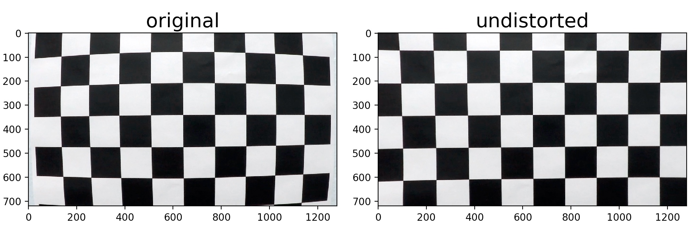
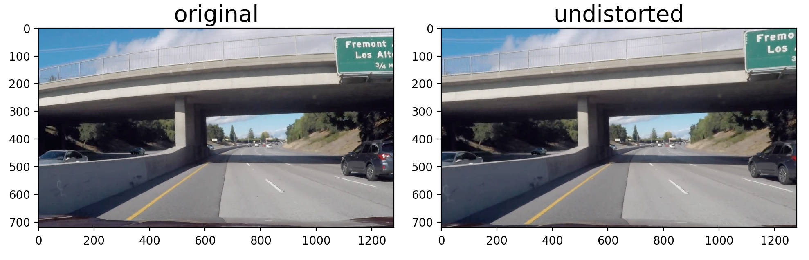
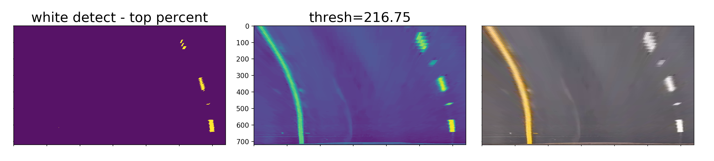
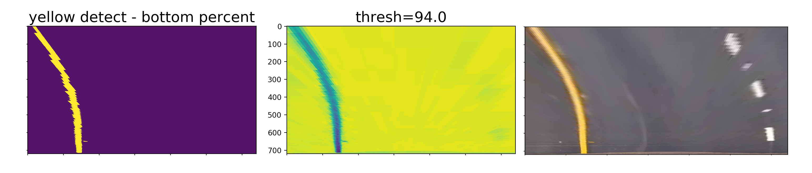
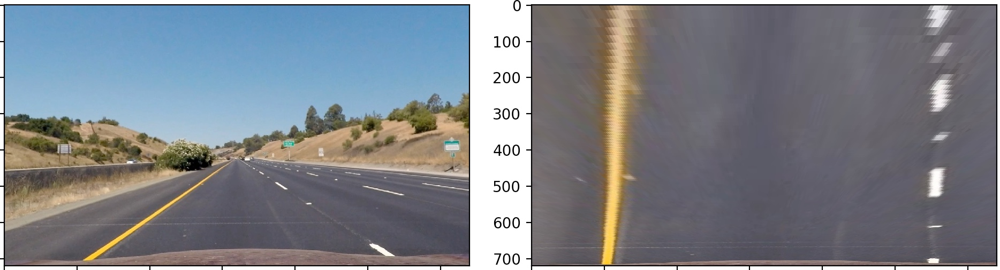
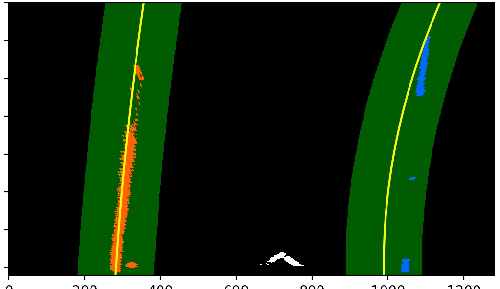
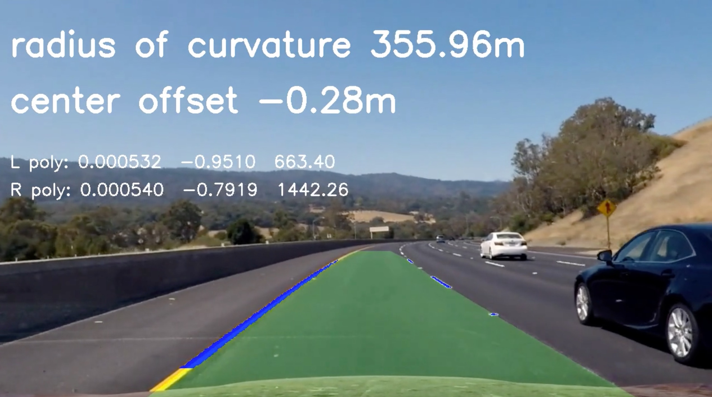

Project 4 - advanced lane finding
---


The goals / steps of this project are the following:

* Compute the camera calibration matrix and distortion coefficients given a set of chessboard images.
* Apply a distortion correction to raw images.
* Use color transforms, gradients, etc., to create a thresholded binary image.
* Apply a perspective transform to rectify binary image ("birds-eye view").
* Detect lane pixels and fit to find_white_and_yellow the lane boundary.
* Determine the curvature of the lane and vehicle position with respect to center.
* Warp the detected lane boundaries back onto the original image.
* Output visual display of the lane boundaries and numerical estimation of lane curvature and vehicle position.


<br>
<br>

## [Rubric](https://review.udacity.com/#!/rubrics/571/view) Points


###Camera Calibration


The code for this step is contained in the file `cam_correct.py` 

I start by preparing "object points", which will be the (x, y, z) coordinates of the chessboard corners in the world. Here I am assuming the chessboard is fixed on the (x, y) plane at z=0, such that the object points are the same for each calibration image.  Thus, `objp` is just a replicated array of coordinates, and `objpoints` will be appended with a copy of it every time I successfully detect all chessboard corners in a test image.  `imgpoints` will be appended with the (x, y) pixel position of each of the corners in the image plane with each successful chessboard detection.  

I then used the output `objpoints` and `imgpoints` to compute the camera calibration and distortion coefficients using the `cv2.calibrateCamera()` function.  I applied this distortion correction to the test image using the `cv2.undistort()` function and obtained this result: 





###Pipeline

I actually never used the example images to develop my pipeline. I went straight for using frames from the `challenge_video.mp4`. So in this section, I will show example frames from the video for each section below.


#### 1. Distortion-corrected image

I created a helper function `pipeline.load_frame_at_time()` in my `pipeline.py` module at line 34 that takes a time in seconds and grabs a frame from a video at that point. Here is an example of a corrected frame from the challenge video. I chose this frame because it shows very clearly the almost fish-eye distortion of the original picture with the bridge overhead.



<br>


#### 2. Lane pixel finding

At the suggestion of my first submission's reviewer, I went with a color finding system based off the paper [Real-time illumination invariant lane detection for lane departure warning system](http://diml.yonsei.ac.kr/papers/Real-time%20Illumination%20Invariant%20Lane%20Detection%20%20for%20Lane%20Departure%20Warning%20System.pdf) by Son, Yoo, Kim, and Sohn. This method detects yellow and white by transforming the RGB color space into the YCbCr color space.

White pixels are found by using the top 90% of the values in the Y channel, and yellow pixels are found by taking the bottom 50% of the values in the Cb channel. Below are pictures showing the detected pixels for yellow and white separately. The separate binary detection images were combined and sent to the line fitting code. See the file `lane_pixels.py` for the simple code.






<br>


####3. Perspective transform

My perspective transform code lives in the `warp.py` module. There are two functions `warp_to_top_down()` and `warp_from_top_down()` that each take an input binary image and warp between world and top-down image space.

To find_white_and_yellow the transformation points, I looked at frames at the very end of my `challenge_corrected.mp4` video where the lane was straight and found some points by eye that looked to be a good trapezoid, and tweaking the camera space parameters so the resulting top-down space lane lines were parallel. My points are defined as follows:


```
camera_space_transform_points = np.float32([[0, 720], [571, 450], [700, 450], [1280, 720]])
warped_space_transform_points = np.float32([[0, 720], [0, 0], [1280, 0], [1280, 720]])
```

This transform works nicely as shown in the following example



<br>


####4. Lane line fit

My lane line fit system is spread across the `lane_find.py` module and the `Line()` class in `line.py`. I start by doing a pre-processing step of setting the bottom 20 pixels to 0 as there are a few reflections on the car hood that can be bothersome. Then I perform a moving-window find_white_and_yellow for the first few frames (code in `lane_find.find_lines_initial()`, line 78) and once the Line() object for the right line (the more difficult one to match as it's not a continuous line through the whole frame) object has more than 20 good frames, then I start using the 'update'-style code in `lane_find.find_lines_update()`, line 155, which searches within a margin around the current fit line.

These pixel positions are then sent into the `Line()` objects in the function `lane_find.fit_curves()`, line 175. The pixels are sent into the `line.update()` function located at line 63 in the `line.py` file.

This function takes the pixel values and fits a 2nd order polynomial to them. There is also a check for whether a minimum number of pixel pairs has been received, otherwise this frame is considered bad. 10 bad frames sets the object to `detected=False` mode which goes back to moving window searching for the lines.

The fit parameters are then added to circular buffers. I originally did a conditional step where the incoming coefficients had to be within a certain percentage of the existing values, but this led to more problems than it was worth. Now a simple 10-point moving average is plenty coupled with a much more robust colored pixel finding algorithm.

 Whenever the fit coefficients are requested (by code in the next section) via `Line.get_fit()`, line 103, the coefficients are built by averaging the circular buffers, and then returned as if they were a fit result from `np.polyfit()`.

Here is an example output from the fit update code. Pixels are only returned that are found within the green colored margin around the existing fit.



<br>


####5. Radius of curvature and vehicle position

These functions are in the `lane_find.py` module, lines 269-307. They are called from the main `lane_find.process()` function as the last steps before returning the image to `pipeline.process()`, line 45, for writing to the video file. This function takes the un-warped image in original camera space and adds the radius of curvatuve and center offset text onto it. 

The radius of curvature is calculated by applying a scaling transform of 3.7 meters per 850 pixels in the X direction and 30 meters per 720 pixels in the vertical direction. I ended up with these numbers by examining a top-down image of the lane, in which the lines are about 850 pixels apart, and the 3.7 meter lane width was a given. For the Y direction, I examined the white dashed lane markers of a top-down image. Each lane marker is 3 meters and there is 6 meters in between each one. Adding up the number of lane markers and spaces in the picture equaled about 30 meters.

For lane center offset, I take the average X coordinate of the polynomials evaluated at the bottom of the image (720 pixels, Y dimension) received from a function to evaluate the polynomials in `line.eval_at_y_point()`, line 131. I compare these values to the midpoint of the frame, which is assumed to be the midpoint of the car. I then apply the same 3.7 meter per 850 pixels to transform that value into real-world coordinates.

<br>


####6. Warp back to camera perspective

I implemented this step in `lane_find.overlay_line_fit()`, line 336. It draws the polygon onto the image. This polygon is then combined with the curvature information and combined with the original image.

I also replace the color-detected pixels with blue as part of this step in the function `lane_find.overlay_binary_pixels()`, line 312.



<br>


---

###Pipeline (video)

#### Final video output. 

Here is a link to my project pipeline video.

[project video](./output_images/project_pipeline.mp4)


---

###Discussion

#### Briefly discuss any problems / issues you faced in your implementation of this project.  Where will your pipeline likely fail?  What could you do to make it more robust?

In my first submission, I spent the most time on the code to smooth out the polynomial coefficients and reject outliers. In hindsight, I now realize this was a bad path to follow down. I was trying to make up for the lack of clean binary pixel information with smoothing and extra processing. 

It turns out that it is much better to develop a robust color finding mechanism because this almost negates the need for filtering on the back end! I started out with a very complex filtering mechanism but reduced it to simply just watching out for potential error conditions such as no pixels found which would lead to math exceptions. But I'm not actively doing anything special for smoothing or processing other than running a circular buffer to hold the 10 latest coefficients. 

I believe to make my system even more robust would require some time of feedback mechanism to ensure that the color threshold parameters are optimal to the current lighting conditions. But I think those improvements are best done when I am working for a self-driving car company, as they may be intellectual property!
